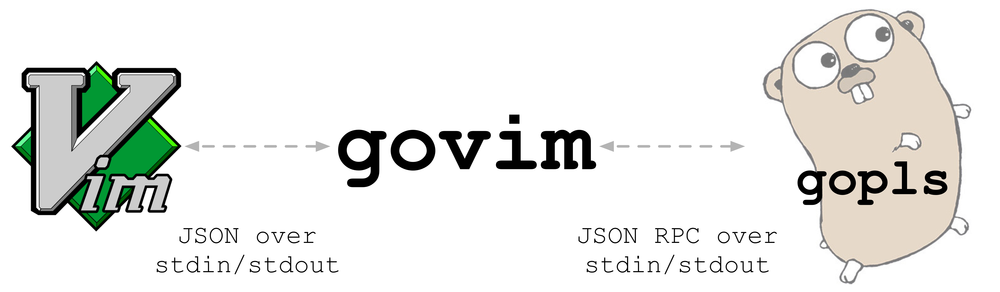

# `govim`'s threading model

In this document we explain the interaction model between Vim, `govim` and `gopls`, i.e. when and how messages are
exchanged between process, how messages are handled, when calls block etc. This discussion is orthogonal to whether
processes communicate using pipes or sockets. One important thing to remember throughout is that Vim has no support for
concurrency, that is to say it is single-threaded. Some function calls in Vim can block, and we cover these below.

The high-level archictecture of `govim` looks like this:

Events are the trigger for sending messages between the three processes above. Events within Vim are most easily
understood, because they are, almost exclusively, triggered (directly) by the user. The following Vim events trigger
messages being sent to `govim`:

* when autocommands defined by `govim` fire
* when commands defined by `govim` are called, e.g. `GOVIMGoToDef`
* when functions defined by `govim` are called, e.g. `GOVIMMotion`
* when `listener_add` callback for changes to buffers files fire

`govim` "attaches" callbacks to these events in the [VimScript
shim](https://github.com/govim/govim/blob/master/plugin/govim.vim), callbacks that call
[`ch_evalexpr`](https://vimhelp.org/channel.txt.html#ch_evalexpr%28%29) to send a message from Vim to `govim`.
`ch_evalexpr` is blocking, meaning that Vim is essentially blocked from the caller's (user's) perspective until this
function returns. However, whilst blocked Vim _can_ handle messages received over a channel, i.e. messages that `govim`
may send in response. This allows `govim` to make calls back to Vim that might be required in order to complete handling
of the Vim event, for example determining the cursor position when jumping to a definition. Both Vim and `govim` support
this form of "recursive" calls.

`govim` receives messages from Vim on one go routine, and puts them onto an event queue for processing by another. This
separation allows `govim` to handle recursive calls to/from Vim, as mentioned above. The single go routine processing
the event queue also allows `govim` to mirror Vim's single-threaded nature and simplifies the understanding of
user-triggered events.

* Refine detail that something being run on the event queue are not necessarily synchronised with Vim, unless triggered
  by an event in Vim (at which point blocking is essential)
* Events triggered by Vim are "safe" from the user's perspective, because the Vim single thread is the "source of truth"
* What about other events, e.g. response from `gopls`?
* Introduce concept of scheduling work to happen, and therefore `SafeState` etc from Vim perspective
* Init happens asynchronously during Vim startup, and hence is not scheduled. i.e. nothing in Vim is blocking on the
  startup of `govim`
* Instead we need to "join" Vim and `govim` to again be in sync
* Discuss calls that are made from

### Example: `:GOVIMGoToDef`

Let's take the command `:GOVIMGoToDef` as an example, which also allows us to introduce `gopls` interactions into the
equation. The Vim command is the trigger:

* the user executes the command by typing `:GOVIMGoToDef<Enter>` (or using a key mapping)
* Vim calls [`s:callbackCommand`](https://github.com/govim/govim/blob/master/plugin/govim.vim) in the VimScript shim,
  which in turn calls `ch_evalexpr`
* `govim` receives the message and adds it to an event queue. This separates the receiving of the message from the
  handling. Both the receiving and handling of the message are single-threaded, ensuring we preserve ordering
* ...

We ignore the detail here of the file that contains the definition not already being open, because this would trigger an
autocommand.

govim has its own "protocol" for messaging with Vim. Based loosely on Vim channel commands.

Note, the user is blocked (i.e. cannot do anything else in Vim) from the moment they press `<Enter>` to execute the
command, to the moment `ch_evalexpr` (and hence `s:callbackCommand`) returns.

...
